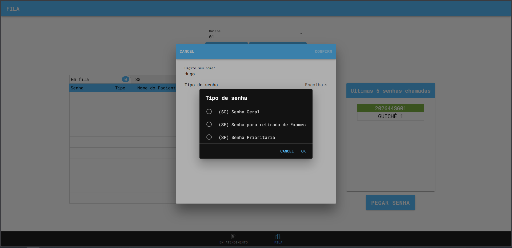
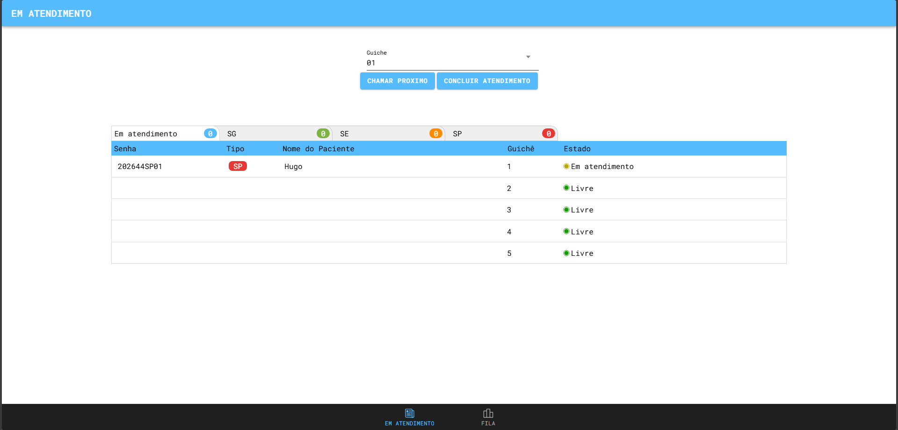
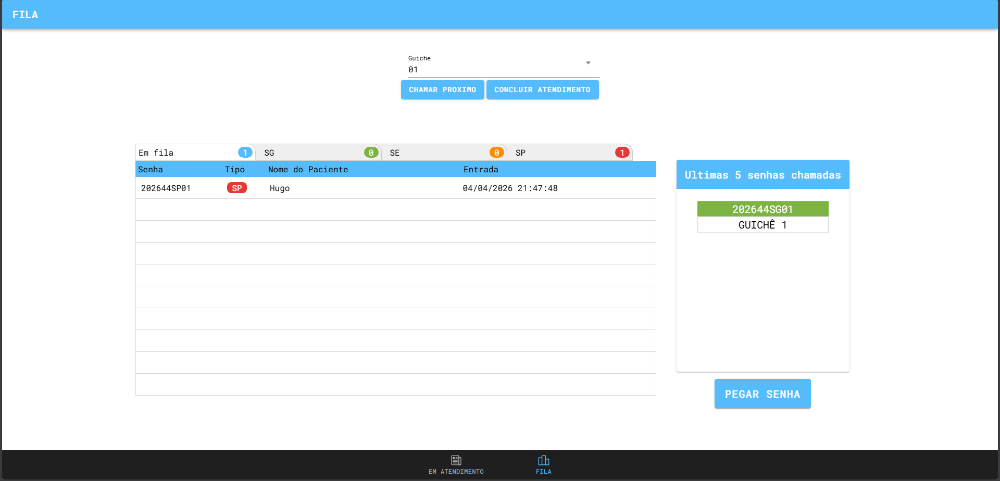

# 📋 Sistema de Gerenciamento de Senhas (Fila)

Este projeto é uma aplicação desenvolvida com **Angular + Ionic**, com o objetivo de gerenciar filas de atendimento de forma simples e organizada.

---

## 🚀 Sobre o projeto

A aplicação simula um sistema de filas onde:

* O usuário pode **retirar uma senha**
* Aguarda até ser chamado por um **agente de atendimento**
* O sistema organiza e prioriza automaticamente as senhas

---

🚀 Acesse o projeto online

👉 <a href="https://mobile-tickets-ionic-i4t8.vercel.app/tabs/tab1">Link</a>

## 🧩 Funcionalidades

### 🎟️ Emissão de senha

* O usuário pode gerar uma senha para atendimento
* Cada senha possui um tipo específico:

  * **SP** → Senha Prioritária
  * **SE** → Senha para Exames
  * **SG** → Senha Geral

---

<p align="center">
  
</p>

---

### 📊 Organização da fila

A fila segue uma ordem de prioridade:

1. 🔴 **SP (Prioritária)**
2. 🟡 **SE (Exames)**
3. 🟢 **SG (Geral)**

---

### 🧑‍💼 Tela de atendimento

* Mostra qual senha está sendo atendida no momento
* Permite ao agente chamar a próxima senha

---

<p align="center">
  
</p>

---

### 📺 Painel de exibição

* Exibe a senha atual em atendimento
* Mostra os **últimos 5 atendimentos realizados**
* Atualização dinâmica da fila

---

<p align="center">
  
</p>

---
## 🛠️ Tecnologias utilizadas

* Angular
* Ionic
* TypeScript
* HTML / SCSS

---

## ▶️ Como rodar o projeto

### Instalar dependências

```bash
npm install
```

### Rodar localmente

```bash
ionic serve
```

A aplicação estará disponível em:

```
http://localhost:8100/
```

---

## 📌 Observações

* O sistema é ideal para simular atendimentos em:

  * Clínicas
  * Hospitais
  * Bancos
  * Atendimento ao público em geral

---

## 👨‍💻 Autor

Projeto desenvolvido por Hugo Leal para fins de estudo e prática com Angular + Ionic.
